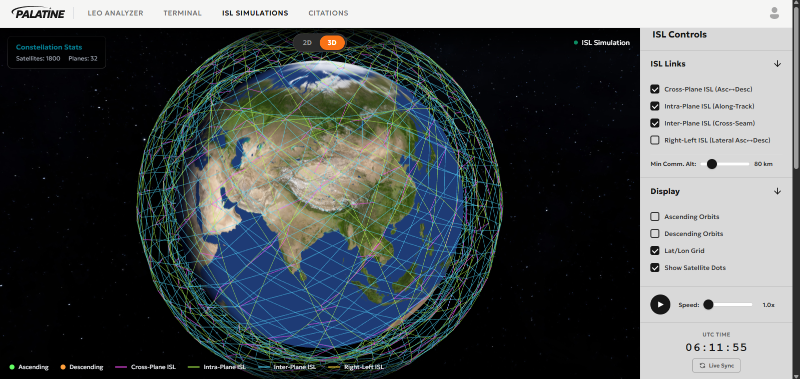
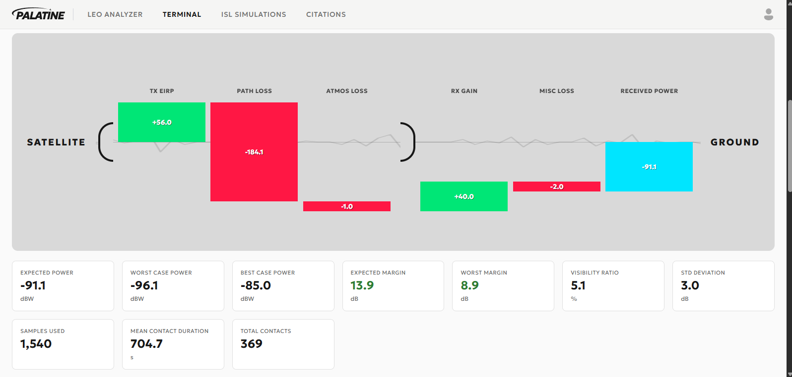

# Palatine Space

<div align="center">
  
</div>

---
<p align="center">
  <a href="https://palatine-space.vercel.app/terminal">
    
  </a>
  <a href="https://www.linkedin.com/in/rezafauzanz/">
    
  </a>
  <a href="https://www.spaceappschallenge.org/2025/">
    
  </a>
</p>

[](https://palatine-space.vercel.app/terminal)
---
A comprehensive web-based platform for Low Earth Orbit (LEO) satellite constellation visualization and link budget analysis. A 

## Features

### 1. 2D Orbit Visualization
*   **Real-time Animation**: Dynamic satellite constellation orbits projected onto a world map.
*   **Interactive Controls**: Toggle between global coverage and specific ground station analysis.

### 2. 3D Pass Analysis (Sky Dome)
*   **Heatmap Visualization**: Sky Dome colored by elevation using custom GLSL shaders (Red at horizon, Blue at zenith).
*   **Pass Trajectories**: Visualizes Shortest, Median, and Longest orbital passes for any given ground station.
*   **Directional Labels**: N, S, E, W, and Zenith markers for intuitive sky orientation.
*   **Satellite Demo**: Animated white-dot satellite simulating actual pass behavior along path lines.

### 3. Advanced Link Budget Calculator
*   **Monte Carlo Simulation**: High-performance client-side simulation (30,000+ samples) for robust statistical analysis.
*   **Hardware Analysis**: Support for EIRP, G/R, Frequency, and Atmospheric attenuation modeling.
*   **Statistical Metrics**: Calculates Worst-case, Expected, and Best-case received power (Pr) and Link Margins.

[](https://palatine-space.vercel.app/terminal)

### 4. Time-Series & Statistical Analysis
*   **Long-term Simulation**: 60-day mission modeling at high-resolution (10s intervals).
*   **Contact Histograms**: Detailed distribution analysis of satellite pass durations.
*   **Gamma Distribution Fitting**: Automatic fitting of elevation probability density functions (PDF).
*   **CDF Verification**: Comparison between empirical mission data and theoretical Gamma-fit CDFs.


## Tech Stack
*   **Backend**: Flask (Python) - optimized for Vercel Serverless deployment.
*   **3D Engine**: Three.js (WebGL).
*   **Charts**: Chart.js.
*   **Simulation**: Vanilla JavaScript with TypedArrays for high-speed client-side math.

## Installation & Setup

1.  **Clone the repository**:
    ```bash
    git clone https://github.com/Astro-Reza/PalatineSpace.git
    cd PalatineSpace
    ```
2.  **Install dependencies**:
    ```bash
    pip install -r requirements.txt
    ```
## Deployment
The repository includes a `vercel.json` configuration for immediate deployment on the **Vercel** platform, utilizing its serverless Python environment and static asset optimization.

---
© 2026 **Palatine Technologies**. Developed for the NASA Space Apps Challenge Jakarta.
